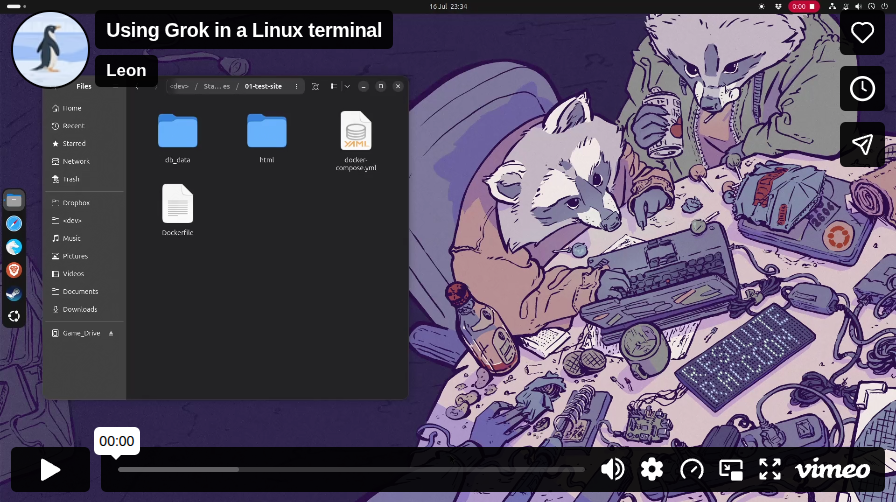

<p align="center">
  <a href="https://vimeo.com/1210626534?share=copy&fl=sv&fe=ci" target="_blank" rel="noopener noreferrer">
    
  </a>
  <br />
  <em>Click the thumbnail to watch the demo on Vimeo</em>
</p>


# Grok Flatpak Launcher

A simple Flatpak wrapper that provides a desktop icon and menu entry for Grok Build.

When you open the **Grok** app icon, it starts a host terminal with a small launcher menu:

1. **Launch Grok** — install Grok Build if needed, then start the TUI  
2. **Diagnostics** — shows only the dependencies that apply to your DE and WM.
3. **Source code** — opens this repository in your browser  

Right-click **Open with Grok** on a folder skips the menu and opens Grok in that directory.

## Requirements (on your host system)
- Flatpak installed (`flatpak --version`)
- flatpak-builder (for building from source)
- A terminal emulator (gnome-terminal, konsole, alacritty, kitty, etc. — the launcher auto-detects most common ones)
- Internet connection for the one-time install of Grok Build

## Build & Install

```bash
cd Grok-Launcher-main/   # or your checkout directory

# Build and install for your user
flatpak-builder --user --install --force-clean build-dir org.grokbuild.Launcher.yml

# Or system-wide (requires root/sudo for some steps)
# flatpak-builder --system --install --force-clean build-dir org.grokbuild.Launcher.yml
```

After installation, you should see **Grok** in your application menu / launcher.

<p align="center">
  
  <br />
  <em>Grok Launcher menu → select 'Diagnostics'</em>
</p>

<p align="center">
  
  <br />
  <em>Diagnostics menu → select 'Ask Grok to fix this'</em>
</p>

Depending on your DE and WM, you may have additional dependencies for the 'Open Grok in right-click menu' feature within your window manager.

## Open with Grok (file manager context menu)

Right-click a **folder** and choose **Open with Grok** to launch Grok already `cd`'d into that directory (no launcher menu).

<p align="center">
  
  <br />
  <em>Right-click a project folder → Open with Grok</em>
</p>

<p align="center">
  
  <br />
  <em>Grok opens in a terminal already set to that directory</em>
</p>

### Install the context menu entries

After installing the Flatpak (CLI; advanced):

```bash
flatpak run org.grokbuild.Launcher --install-context-menu
```

Check / remove:

```bash
flatpak run org.grokbuild.Launcher --status-context-menu
flatpak run org.grokbuild.Launcher --uninstall-context-menu
```

Use **Diagnostics** in the launcher menu to see whether context-menu (and related) pieces are present for your desktop.

### Desktop environment support

<table>
  <tr>
    <th>Environment</th>
    <th>File manager</th>
    <th>How it appears</th>
  </tr>
  <tr>
    <td><strong>GNOME</strong></td>
    <td>Nautilus (Files)</td>
    <td>Top-level <strong>Open with Grok</strong> (via <code>python3-nautilus</code> extension)</td>
  </tr>
  <tr>
    <td><strong>KDE Plasma</strong></td>
    <td>Dolphin</td>
    <td>Top-level <strong>Open with Grok</strong> (service menu)</td>
  </tr>
  <tr>
    <td><strong>Cinnamon</strong></td>
    <td>Nemo</td>
    <td>Top-level <strong>Open with Grok</strong> (Nemo action)</td>
  </tr>
  <tr>
    <td><strong>COSMIC</strong></td>
    <td>COSMIC Files</td>
    <td>Custom context menus are <a href="https://github.com/pop-os/cosmic-files/issues/1445">not supported yet</a>. Use <strong>Open With → Grok</strong> if offered, or <code>flatpak run org.grokbuild.Launcher /path/to/project</code></td>
  </tr>
</table>

**GNOME note:** top-level menu items need the host package `python3-nautilus` (Debian/Ubuntu) or `nautilus-python` (Fedora/Arch).

**Open With** is also registered for folders on any desktop that honors the shared desktop entry (`MimeType=inode/directory`): right-click folder → Open With → **Grok**.

You may need to restart the file manager once after installing the integrations (`nautilus -q`, `nemo -q`, or re-open Dolphin).

## Notes & Customization

- **First launch**: Open the app icon → **Launch Grok**. If the CLI is missing, it installs Grok (needs internet) and shows progress in the terminal.
- **Authentication**: On first `grok` run, it opens a browser window for xAI login (SuperGrok / Premium+ required for Grok Build).
- **Project directory**: **Launch Grok** from the menu starts in `$HOME`. Prefer **Open with Grok** on a project folder, or pass a path on the command line (skips the menu).
- **Diagnostics**: Only lists dependencies for your current desktop (e.g. GNOME shows Grok Build, context-menu, python3-nautilus; KDE/Cinnamon omit Nautilus-specific packages).
- **Terminal preference**: The launcher tries common terminals in this order: gnome-terminal, konsole, xfce4-terminal, mate-terminal, lxterminal, alacritty, kitty, wezterm, foot, xterm.
  If your favorite terminal isn't launched, you can edit `grok-launcher.sh` and adjust the `TERMINALS` array + the `launch_in_terminal()` case.
- **Uninstall**:
  ```bash
  flatpak run org.grokbuild.Launcher --uninstall-context-menu   # optional cleanup
  flatpak uninstall org.grokbuild.Launcher
  flatpak uninstall --unused   # cleanup
  ```

## Why a Flatpak for this?

Grok is a fantastic CLI tool, but many Linux users (especially less technical ones) appreciate having a polished desktop icon that "just works". This Flatpak does exactly that without packaging the Grok binary itself (it re-uses the official host installation for maximum compatibility and access to your files).

## License / Disclaimer

Source code is licensed under the [MIT License](LICENSE.md).

This is an unofficial community launcher created for convenience. Grok and Grok Build are trademarks of xAI. The actual Grok CLI is installed from the official xAI servers.

---

Enjoy.
